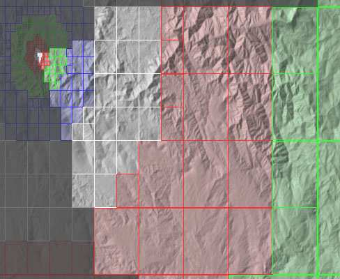
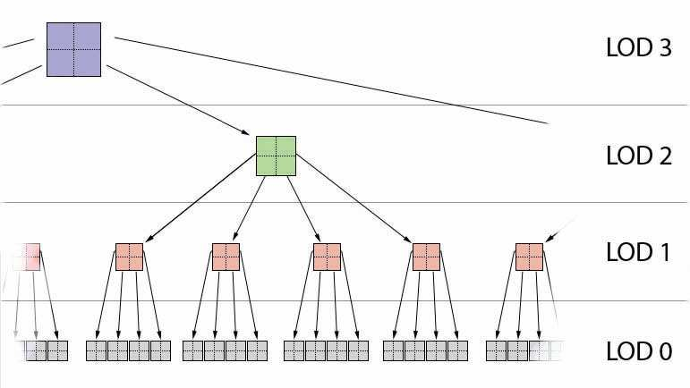
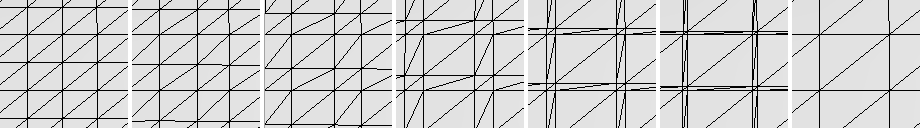
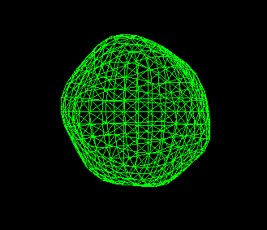
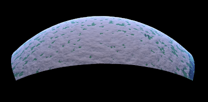
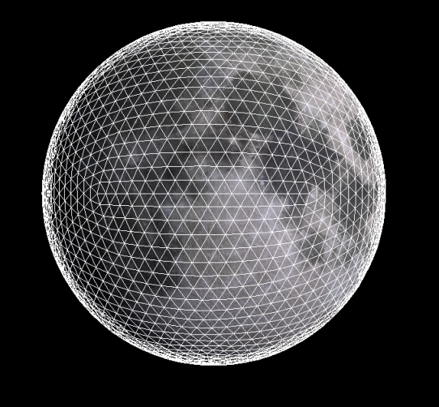
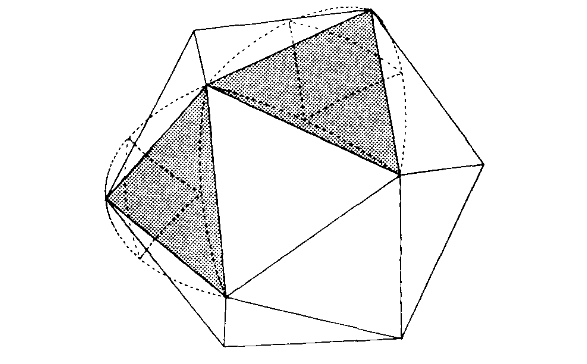
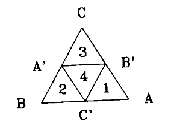
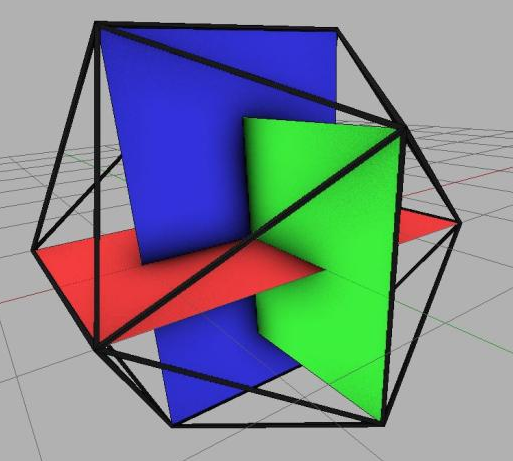
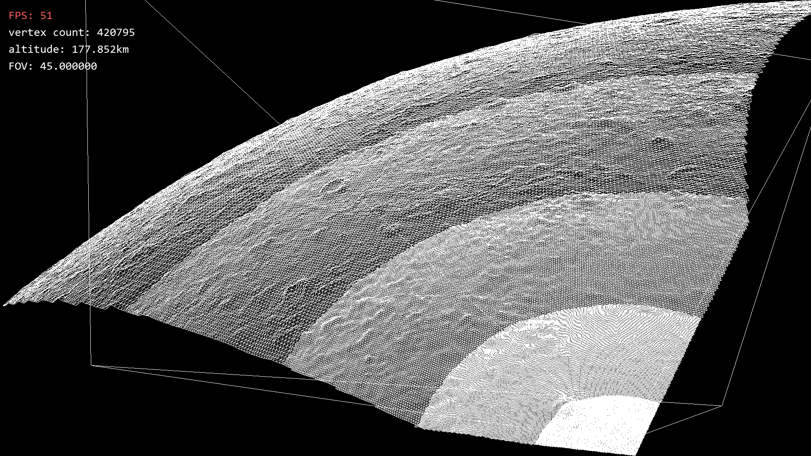

% Génération procédurale de planètes
% Bernard Jérémi; Maze Brian; Maugey Rémy; Alonso Hugo

# Introduction

. . . 

- CDLOD (*Continuous Distance-dependant Level Of Detail*)

. . . 

- Premier rendu

. . .

- Suite du projet

:::notes
But du projet:
Générer une planète
Implémenter l'algorithme de CDLOD de Philipe Strugar
:::

---

# Algorithme de CDLOD

---

:::notes
- Algorithme de LOD
Pour réduire le nombre de triangle d'un modèle 3D afin d'optimiser son
affichage en fonction de la distance à la caméra
:::

---

 

:::notes
-Fonctionnement
Les niveaux de détails sont répartis dans un quadtree, arbre à quatre
fils.
Chaque node représente une zone du terrain, et l'ensemble de ses fils
couvrent cette même zone.

Parcours de l'arbre:
- Regarder si la node est visible

- Si oui, je regarde si je suis à la bonne distance pour mon niveau de
    détail

- Si oui, je m'affiche moi-même

- Si je suis trop près, je continue le parcours sur l'ensemble de mes
    fils
:::

---

:::notes
Pour passer progressivement d'un niveau de détail à un autre
On décale les points du niveau de détail élevé pour les rapprocher de
ceux du niveau de détail moins élevé, jusqu'à ce qu'ils soient
confondus.
:::

---

# Premier rendu

- Prototype
- WorldGenerator

---

# Prototype

:::notes
Pas de CDLOD, juste affichage d'une sphère avec un bruit appliqué

Trop de travail pour résultat finale.
:::

---

# WorldGenerator

:::notes
Porté sous Linux, résultat nul
Problèmes d'affichages, performances, problème de caméra etc

Pas viable
:::

---

# PlanetRenderer

:::notes
Linux, CDLOD complet
Fonctionne bien

Différences avec les projets précédents:
La sphère est un icosahèdre subdivisé et non un cube déformé.

OpenGL 4.5
:::

---

---

:::notes
La subdivision de l'icosahèdre pour générer le maillage sert à créer le
quadtree. Le quadtree contient uniquement les sommets des triangles, les
hauteurs sont appliquées lors de l'affichage du mayage, en faisant
correspondre les coordonnées polaires du point sur la sphère à ses
coordonnées sur la carte de hauteur 2D.
:::

---

# A faire

- Porter sous OpenGL 3
- Génération procédurale de la carte de hauteur
- Tests unitaires
- Tests de performances
- Documentation

---

# Sources

- 1) *Continuous Distance-Dependent Level of Detail for Rendering Heightmaps (CDLOD)*, Philipe Strugar, 2010
- 2) *Rendering and managing spherical data with Sphere Quadtrees*, György Fekete

---

# Annexes

---

:::notes
12 sommets 20 faces
nombre d'or
:::

---

- *Planet Rendering research*, Robert Lindner

