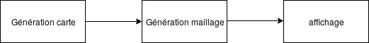

% TD2
% Jérémi
% 30 janvier 2018

## Intro
Trop direct, mettre une image
- Refaire l'intro, plus générale.
- On veut faire une planète, générer procéduralement...
- Définir maillage, carte de hauteur
- temps reel vs temps interactif
- expliquer les liens entre la heightmap et le maillage
- Comment passer de la heightmap au maillage
- Mettre des schémas
- comment est fait une sphère
- définir opengl, la version utilisé (celle au crémi) 
- retirer la lib de l'intro

## Etat de l'art
CDLOD : ecrire qu'il y a du code de dispo, marche pas sous windows et sous linux, fait en c++ et dx. Pas réutilisable.
- expliquer en détail le quadtree, notion de hierachie
- Algo roam, présenter la borne min.  (A voir dans le rapport)
- faire des schémas
- Montrer que l'on a fait des recherches sur l'existant
- synthèse du papier CDLOD
- Pourquoi actuellement tous est sur GPU
- url terragen, élite dangerous + images
- frustrum
- essayer de générer le maillage dans affichage, via blender
- presentation des algos de bruit, noise, simplex

## BF
- niveau de priorité
- quantification, elements de faisabilité, expliquer, justifier avec des schémas/UML
- faire des scénarios

## BNF
- nb de niveau dans l'arbre, fixe, variable ?
- type de donnée, float, unsigned short ? estimer la conso de ram.
- expliquer la liaison entre les sommets. (TRI_STRIPS, TRI_FANS)
- définir le format de retour de la lib
- chiffrer les performances
  - par rapport aux autres
  - mais pas de contraintes de fps imposées par le client
- Robustesse (pas de trout dans le terrain)
- poping artefact ?

