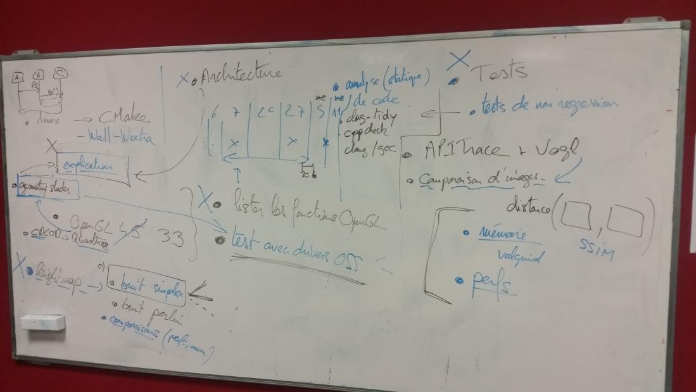

% TD5
% Brian Mazé
% 6 Mars 2018

# Critique de la 1er release

Travail à ce répartir afin de pouvoir travailler sur des parties différentes et regrouper.

# Implémentation de Planet Renderer

-CDLOD = Ok !   
-Quadtree(streamingCDLOD version)
-Heightmap lue depuis le disque

# Travail à effectuer

 -Lister les fonctions OpenGL
 -Test de régression
 -Génération procédural de Heightmap
 -Explication de l'architecture
 -Explication de l'implémentation

#Partie Tests

-Tests de non régression
-analyse(statique) de code
-tests mémoire
-tests de performances

